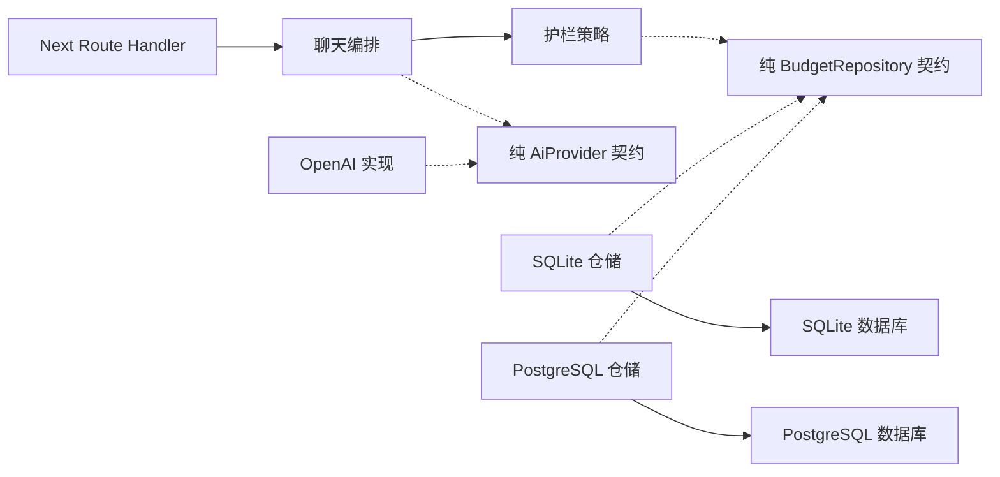

# 耦合检查 — 2026-10-01

用户在预算可靠性实施中要求“记得检查耦合度”。本轮先检查依赖，再做最小契约调整，没有拆服务或改写架构。

## 发现与修复

- 原 `createGuardrails`、`underDailyBudget` 的参数类型依赖整个 SQLite `createRepository` 返回值，护栏因此被要求知道商品、embedding 和具体仓储工厂；这是既有类型耦合，新增预算方法会扩大它。
- 新增纯类型 `src/server/guardrails/budget-contract.ts`，由护栏拥有预算接口；SQLite/PostgreSQL 实现共同使用请求/用量类型。护栏不再引用具体仓储或 ORM；日预算读取只需要单个 `dayTokenUsage` 方法。
- `src/server/ai/provider.ts` 仍是纯类型契约，取消采用标准 AbortSignal；OpenAI SDK 只在实现层。Route Handler 只负责 HTTP、Cookie 和流生命周期，预算事务仍在仓储。
- Python application/domain 未发现 FastAPI、Starlette 或 API 路由导入。其业务逻辑和 ORM 模型仍依赖 SQLAlchemy，是现有架构边界，本轮保留并记录，没有声称领域模型完全与 ORM 解耦。

虚线为契约依赖，运行时由聊天编排注入实现。两种数据库保留不同事务代码，避免为了去重把 ORM 细节反向引入护栏。

## 实际检查

`npm run check:coupling` 使用当前 TypeScript compiler API 解析 import/re-export、解析 tsconfig alias，并分析去掉类型导入后的 JS。生产源码检查结果：**145 个模块、257 条静态运行时依赖，0 个循环，0 个领域/护栏边界违规**。初始 144 个模块的检查也没有运行时循环；新增模块为纯预算契约，没有增加运行时依赖边。

`npm run check:boundary` 通过，Client Component 未运行时导入服务端模块。`npm run typecheck` 通过，两种实现及当前调用点满足独立预算接口。`rg` 对 Python application/domain 的 FastAPI/Starlette/API 导入检查为零匹配。

新检查已加入 `npm run verify`，现有 CI 会自动执行；不新增依赖，package-lock 依赖记录不变。最终完整门禁和双服务结果见 [预算恢复报告](./ai-budget-recovery-2026-10-01.md)。

接口调整后实际重跑完整 verify（含真实 PostgreSQL/TLS）通过 **76 文件 / 553 项测试**，build 通过 **45 个静态页面**；不是只用静态依赖数字代替行为验证。

范围是静态模块与类型边界，不是所有运行时行为、动态加载或团队维护成本的证明。未发现生产源码动态 import/require；仍需用实际模块测试验证注入与事务行为。

## 保留的边界与风险

SQLite/PostgreSQL 预算事务有对应重复代码，现阶段通过共享类型、同一行为验收和真实数据库测试防漂移。后续事务变化必须两侧一起验证；本轮不增加通用 ORM 或仓储基类。

TS ORM schema 与幂等 DDL 仍分开维护；Python schema/migration 独立。TS 展示目录和 Python 交易目录通过显式导入及 handle 关联，尚无持续同步和删除传播。契约解耦不会自动解决数据漂移或共享状态；这些仍是阶段 C 待办。

回滚契约调整不涉及 schema 或配置迁移。若回退代码，配套恢复 check:coupling 与接口引用，不能仅删除接口文件。预算安全回滚限制见预算恢复报告。
